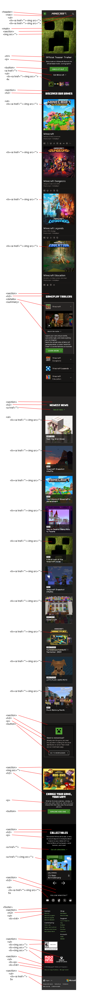

# Procesverslag
Markdown is een simpele manier om HTML te schrijven.  
Markdown cheat cheet: [Hulp bij het schrijven van Markdown](https://github.com/adam-p/markdown-here/wiki/Markdown-Cheatsheet).

Nb. De standaardstructuur en de spartaanse opmaak van de README.md zijn helemaal prima. Het gaat om de inhoud van je procesverslag. Besteedt de tijd voor pracht en praal aan je website.

Nb. Door *open* toe te voegen aan een *details* element kun je deze standaard open zetten. Fijn om dat steeds voor de relevante stuk(ken) te doen.

## Jij

  
uitwerken voor kick-off werkgroep

  ### Auteur:
  Javier Renfurm

  #### Je startniveau:
  Blauw

  #### Je focus:
  Surface plane
 

## Je website

  
uitwerken voor kick-off werkgroep

  ### Je opdracht:
  link naar de website die je gaat namaken óf de naam/omschrijving van je eigen ontwerp:
  https://www.minecraft.net/en-us

  #### Screenshot(s) van de eerste pagina (small screen): 
  Home pagina  
  

  #### Screenshot(s) van de tweede pagina (small screen):
  Minecraft about pagina  
  
 

## Toegankelijkheidstest 1/2 (week 1)

  
uitwerken na test in 2e werkgroep

  ### Bevindingen
  Screenreader test in de klas
  Tijdens de toegankelijkheidstest in de klas moest ik met behulp van een screen reader door mijn gekozen site navigeren en ik moet zeggen dat ik verbaasd ben
  met hoe toegankelijk de Minecraft website is. De screen reader las alle belangrijke kopjes en tekst op de site goed voor en op de juiste volgorde, 
  maar er was wel één minpunt en dat was dat de screen reader ook voorlas op wat voor element de content stond: (list, container etc).

  A11y checklist
  Content
  - Gebruikt gewone taal dat ik kan begrijpen
  - De buttons, a's en labels hebben unieke omschrijvingen omdat de screenreader letterlijk leest wat er te zien is
  - Tekst is over het algemeen correct uitgelijnd maar soms is het gecentreerd

  Global code
  - Code is valid
  - Lang attribute word gebruikt en staat op de juiste taal
  - Titels zijn uniek op elke pagina
  - Viewport is niet disabled
  - Landmark elementen worden gebruikt alleen zitten ze erg verstopt
  - Geen tabindex in de code te zien
  - Ik zie geen autofocus attribute gebruikt worden maar kan goed zijn dat ik het over het hoofd heb gezien
  - Er zijn geen timers of andere elementen op de site die je sessie kunnen eindigen, je hebt dat zelf in de hand
  - Titel heeft geen exclusive informatie

  Keyboard
  - Alles word goed voor gelezen en kan genavigeerd worden zonder muis
  - Met een toetsenbord en de tab toets kan je op een logische volgorde door de pagina's navigeren
  - Geen onzichtbare elementen waar op gefocust kan worden

  Images
  - Alle afbeeldingen hebben een alt attribute
  - Ik kan geen null alt attributes vinden
  - Er zijn geen overcomplexe afbeeldingen aanwezig (ze waren niet complex voor mij)
  - Alt omschrijvingen bevatten ook de tekst dat zichtbaar is

  Headings
  - Bevat headings elementen
  - Heeft één h1 per pagina, maar de h1 is onzichtbaar (of super klein)
  - de headings staan op de juiste volgorde
  - Er worden geen headings geskipt

  Lists
  - List items worden correct gebruikt

  Controls
  - a wordt gebruikt voor links
  - Links hebben een kleur dat ze klikbaar laten lijken
  - Er zijn focus states aanwezig
  - Buttons hebben de button attribute
  - De website skipt automatisch bepaalde content als je erdoorheen navigeert met de tab toets
  - Alleen het kopje merch brengt je naar een nieuw venster, maar je kan er niet perongeluk op drukken en er word ook aangegeven dat er een nieuw venster word geopend doormiddel van een icoon

  Tables
  - Td attribute word gebruikt voor tabellen
  - Th wordt gebruikt
  - Caption word gebruikt

  Forms
  - Zit in een label
  - Ik kon geen fieldset of legend vinden
  - Invoerveld bevat autocomplete doormiddel van suggested searches
  - Invoerveld bevat geen error state en geeft alternatieve zoekresultaten
  - nvt
  - nvt

  Media
  - Media zoals live wallpapers speelt automatisch af, maar media zoals YouTube videos staan automatisch gepauzeerd tot jij op play drukt
  - Pauze knop voor media is zichtbaar maar er is geen mute knop
  - Alle bewegende media kan op pauze, maar voor mij lukte het niet om de video met mijn toetsenbord te pauzeren
    
  Video
  - Er zijn geen captions
  - er zijn geen flitsende animaties

  Audio
  - Goed navolgbaar met een screenreader

  Appearance
  - Met inverted mode aan kon ik alle content nog steeds zien
  - Tekst is nog steeds leesbaar op 200 en de layout past zich ook aan zodat er geen overlappingen zijn
  - Mensen die screen zoom software gebruiken kunnen alles nog steeds zien omdat de layout zich aanpast
  - Linkjes zijn nog steeds herkenbaar in grayscale omdat ze donkerder zijn dan body tekst en bold zijn
  - karakteristieken worden benoemd
  - Layout is simpel en makkelijk te volgen

  Animations
  - Animaties zijn zo subtiel dat ik ze niet altijd door heb
  - Animaties kunnen gepauseerd worden
  - Reduce motion lijkt niet te werken

  Color contrast
  - Witte tekst op een donker achtergrond (goede contrast lijkt mij)
  - Witte tekst op een donker achtergrond (goede contrast lijkt mij)
  - Belangrijke iconen vallen op en hebben een witte uitlijn of een andere manier van opvalling als je eroverheen hovert en minder belangrijke iconen lijken bijna te verdwijnen in de achtergrond
  - Witte of fel groene border als een element of invoerveld geselecteerd is
  - Tekst is leesbaar als het overlapt met een foto of video omdat er een vakje om de tekst heen zit
  - nvt

  Mobile & Touch
  - De website roteert mee
  - Er is geen horizontale scrolling, horizontale navigatie hebben zij met knopjes gedaan
  - Alles is makkelijk om op te drukken behalve de linkjes in de footer (die zijn te klein om accuraat op te drukken)
  - Genoeg ruimte om te scrollen zonder perongeluk op iets te drukken
  

## Breakdownschets (week 1)

  
uitwerken na afloop 3e werkgroep

  ### de hele pagina: 
  

  ### dynamisch deel (bijv menu): 
  

  ### wellicht nog een dynamisch deel (bijv filter): 
  

## Voortgang 1 (week 2)

  
uitwerken voor 1e voortgang

  ### Stand van zaken
  Ik kreeg te horen dat ik goed op weg was, maar ik vind het wel nog lastig om een nette html structuur aan te houden. Ik kreeg als suggestie om meer met   
  sections en articles te werken zodat mijn html structuur wat netter word.
  

  ### Agenda voor meeting
  samen met je groepje opstellen

  | student 1      | student 2          | student 3    | student 4        |
  | ---            | ---                | ---          | ---              |
  | dit bespreken  | en dit             | en ik dit    | en dan ik dat    |
  | en dat ook nog | dit als er tijd is | nog een punt | dit wil ik zeker |
  | Hoe maak je een dropdown menu?            |                 | ...          | ...              |

  ### Verslag van meeting
  hier na afloop snel de uitkomsten van de meeting vastleggen

  - punt 1 Details en summary tags gebruiken voor dropdown menu's
  - punt 2 Surface plane suggestie: De live wallpaper die op de tweede pagina staat interactief maken door bepaalde elementen op de wallpaper klikbaar te maken
  - nog een punt
  - ...

## Voortgang 2 (week 3)

  
uitwerken voor 2e voortgang

  ### Stand van zaken
  hier dit ging goed & dit was lastig (neem ook screenshots op van delen van je website en code)
  

  ### Agenda voor meeting
  samen met je groepje opstellen

  | student 1      | student 2          | student 3    | student 4        |
  | ---            | ---                | ---          | ---              |
  | dit bespreken  | en dit             | en ik dit    | en dan ik dat    |
  | en dat ook nog | dit als er tijd is | nog een punt | dit wil ik zeker |
  | ...            | ...                | ...          | ...              |

  ### Verslag van meeting
  hier na afloop snel de uitkomsten van de meeting vastleggen

  - punt 1 Goed nadenken over wat mijn 5 surface plane elementen worden
  - punt 2 Readme optijd aanvullen voordat ik alles vergeten ben
  - nog een punt Suggestie voor surface plane: Reduce Motion
- ...

## Toegankelijkheidstest 2/2 (week 4)

  
uitwerken na test in 9e werkgroep

  ### Bevindingen
  Lijst met je bevindingen die in de test naar voren kwamen (geef ook aan wat er verbeterd is):

## Voortgang 3 (week 4)

  
uitwerken voor 3e voortgang

  ### Stand van zaken
  hier dit ging goed & dit was lastig (neem ook screenshots op van delen van je website en code)

  ### Agenda voor meeting
  samen met je groepje opstellen

  | student 1      | student 2          | student 3    | student 4        |
  | ---            | ---                | ---          | ---              |
  | dit bespreken  | en dit             | en ik dit    | en dan ik dat    |
  | en dat ook nog | dit als er tijd is | nog een punt | dit wil ik zeker |
  | Hoe maak je een hamburger menu? | Hoe uitgebreid moet de README uitgetypt zijn? | Waarom heeft dit plaatje een grijsvlak? | Mag je een div gebruiken als een section geen h2 heeft?              |

  ### Verslag van meeting
  hier na afloop snel de uitkomsten van de meeting vastleggen

  - punt 1 Website hoeft niet 1 op 1 te zijn met de originele website, werk alleen uit wat ik nuttig vind
  - punt 2 Surface plane hoeft niet al te ingewikkelde dingen te zijn, het kunnen ook kleine verbeteringen zijn
  - nog een punt
  - ...

## Eindgesprek (week 5)

  
uitwerken voor eindgesprek

  ### Je uitkomst - karakteristiek screenshots:
  

  ### Dit ging goed/Heb ik geleerd: 
  Korte omschrijving met plaatjes

  

  ### Dit was lastig/Is niet gelukt:
  Korte omschrijving met plaatjes

  

## Bronnenlijst

  
continu bijhouden terwijl je werkt

  Nb. Wees specifiek ('css-tricks' als bron is bijv. niet specifiek genoeg). 
  Nb. ChatGpT en andere AI horen er ook bij.
  Nb. Vermeld de bronnen ook in je code.

  1. bron 1: foto's van de website (https://www.minecraft.net/en-us)
  2. bron 2: Logo (https://www.zenbusiness.com/blog/minecraft-logo/)
  3. ...

